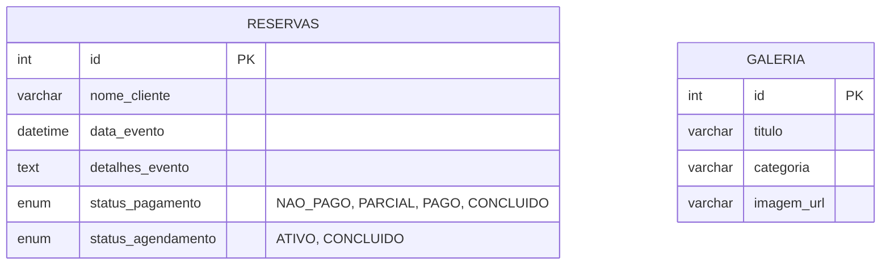

# 🏰 Rauber Festas e Eventos - Sistema de Gestão

Sistema web desenvolvido para gerenciamento de agendamentos e vitrine virtual do espaço **Rauber Festas e Eventos**. O projeto conta com calendário interativo, galeria de fotos dinâmica e painel administrativo financeiro.

## 🚀 Tecnologias Utilizadas

- **Front-end:** HTML5, CSS3, Bootstrap 5, JavaScript (Vanilla), FullCalendar.
- **Back-end:** Node.js, Express.
- **Segurança:** Bcrypt (Criptografia de senhas), Cors.
- **Banco de Dados:** MySQL 8.
- **Outros:** Multer (Uploads).

## ⚙️ Funcionalidades

### 👤 Público (Vitrine)
- Visualização do espaço e planos.
- Calendário de disponibilidade (respeitando privacidade - LGPD).
- Galeria de fotos reais dos eventos.
- Links diretos para contato (WhatsApp).

## 📚 Documentação
O projeto foi desenvolvido seguindo a metodologia em espiral. Você pode conferir os diagramas UML, casos de uso e requisitos detalhados no documento oficial:

📄 **[Ver Documentação Completa (PDF)](docs/Rauber%20Festas%20e%20Eventos.pdf)**

### 🛡️ Administrativo (Gestão)
- **Login Seguro** (Validado no backend com hash criptográfico Bcrypt).
- **Gestão de Agenda:** Criar, Editar e Finalizar eventos.
- **Controle Financeiro:** Status visual (🔴 Não Pago | 🟡 Parcial | 🟢 Pago).
- **Histórico:** Registro de eventos concluídos.
- **Gestão de Mídia:** Upload e exclusão de fotos da galeria.

---

## 🎓 Avaliação: Engenharia de Aplicações Web
Este projeto atende integralmente aos 5 critérios exigidos na disciplina:

1. **Documentação e Arquitetura:** Aplicação do padrão Cliente-Servidor e diagramas detalhados.
2. **API REST:** Implementação completa com os 4 verbos HTTP (`GET`, `POST`, `PUT`, `DELETE`).
3. **Segurança:** Utilização de políticas `CORS` e senhas protegidas com *hash* criptográfico (`Bcrypt`).
4. **Responsividade:** Interface 100% adaptada para dispositivos móveis (*Mobile First* e *Media Queries*).
5. **Separação de Responsabilidades:** Código *Frontend* (pasta `client/`) totalmente isolado da regra de negócio do *Backend* (pasta `server/`).

## 🏗️ Arquitetura e Padrões de Projeto
* **Cliente-Servidor:** O *Frontend* atua apenas na camada de visualização, consumindo os dados da API de forma independente.
* **Padrão RESTful:** * `GET`: Listagem de reservas e carregamento da galeria de fotos.
  * `POST`: Cadastro de novos eventos e upload de imagens.
  * `PUT`: Atualização de dados e finalização de reservas (arquivamento).
  * `DELETE`: Exclusão permanente de registros do banco de dados.

## 🗄️ Diagrama de Banco de Dados (ER)


---

## 🛠️ Como Rodar o Projeto Localmente

### Pré-requisitos
- Node.js instalado.
- MySQL Workbench instalado e rodando.

### Passo 1: Configurar o Banco de Dados
1. Abra o arquivo `sql/database.sql` no MySQL Workbench.
2. Execute o script completo para criar o banco `rauber_db` e as tabelas.
3. **Atenção:** Verifique se a senha do seu banco local corresponde à configuração em `server/server.js`.

### Passo 2: Instalar Dependências
Abra o terminal na pasta server:
```bash
cd server
npm install
```

### Passo 3: Rodar o Servidor
Ainda no terminal da pasta server, inicie a aplicação:
```bash
node server.js
```
O servidor iniciará em `http://localhost:3000`.

### Passo 4: Acessar
- **Site (Vitrine):** Acesse `http://localhost:3000` no seu navegador.
- **Admin:** Acesse `http://localhost:3000/admin.html`

**Credenciais de Acesso:**
- **Login:** admin@rauber.com
- **Senha:** rauber123

---

Desenvolvido por Luis Henrique Rauber.